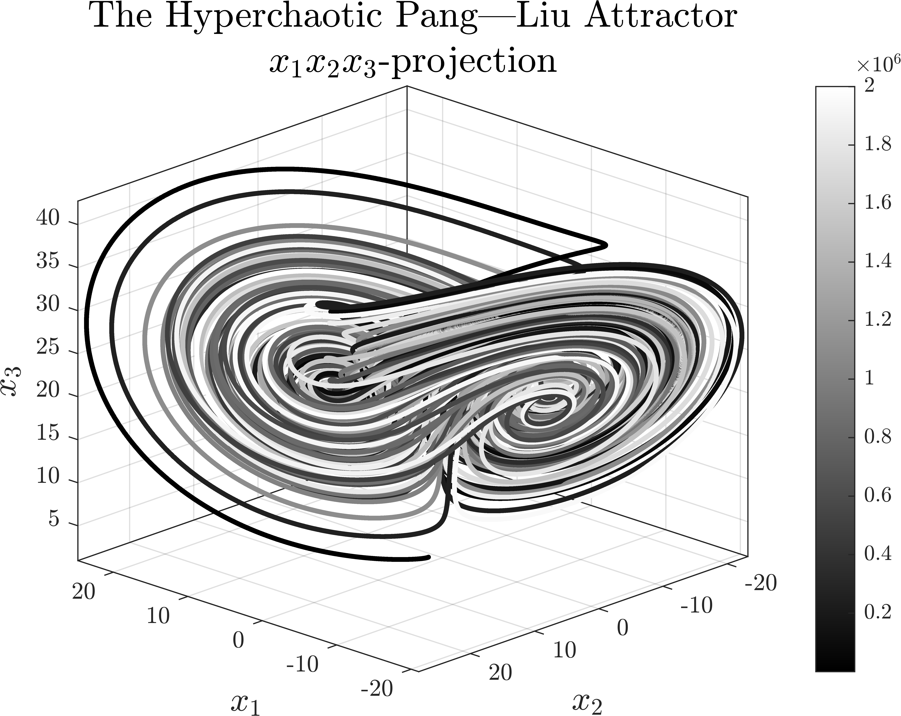
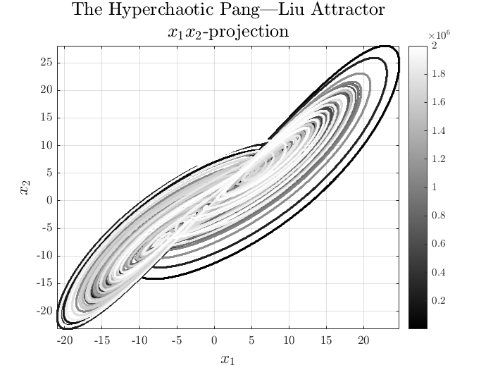
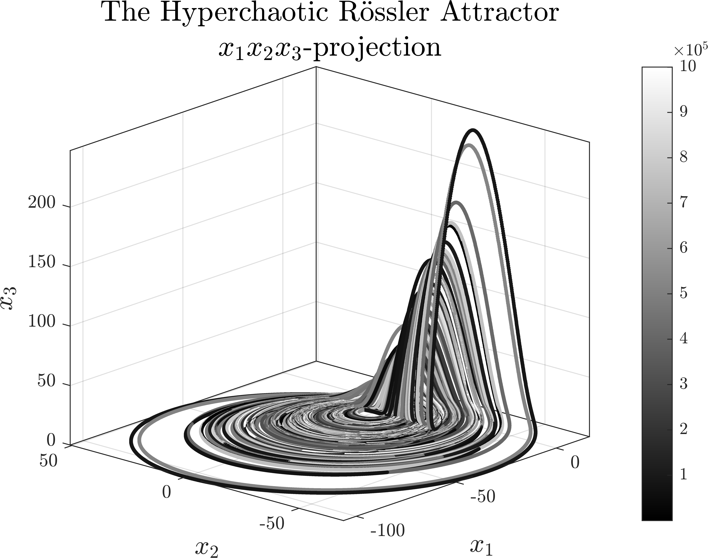
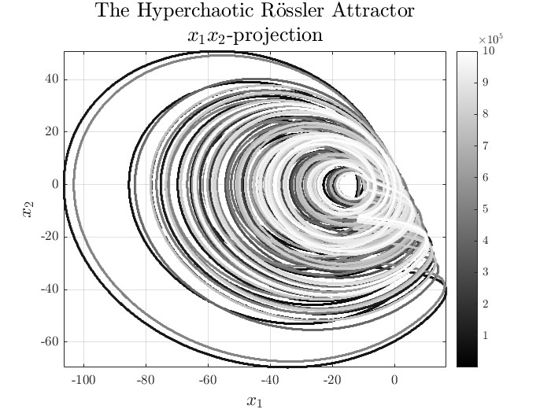

# Dynamics of Hyperchaotic Attractors

The repository will feature a gallery of high-dimensional hyperchaotic attractors. Below are the repositories of the gallery of three-dimensional chaotic attractors:
- [Dynamics of Nonlinear Attractors](https://github.com/whydenyscry/Dynamics-of-Nonlinear-Attractors)
- [Dynamics of Chaotic Attractors](https://github.com/whydenyscry/Dynamics-of-Chaotic-Attractors)

The plots are also available on Pinterest and Behance:

## The Hyperchaotic Pang—Liu Attractor
**Reference:**\
[Pang, S., & Liu, Y. (2011). A new hyperchaotic system from the Lü system and its control. Journal of Computational and Applied Mathematics, 235(8), 2775–2789.](https://doi.org/10.1016/j.cam.2010.11.029)

$$ 
\begin{cases}
	\frac{\mathrm{d}x_1}{\mathrm{d}t} = \alpha\left(x_2-x_1\right)	\\
	\frac{\mathrm{d}x_2}{\mathrm{d}t} = -x_1x_3+\varsigma x_2+x_4, \\
	\frac{\mathrm{d}x_3}{\mathrm{d}t} = x_1x_2-\beta x_3, \\
	\frac{\mathrm{d}x_4}{\mathrm{d}t} = -\delta x_1 -\varepsilon x_2,
\end{cases}
$$

$$
\begin{bmatrix}
	\alpha\\
	\beta\\
	\varsigma\\
	\delta\\
	\varepsilon
\end{bmatrix} = \begin{bmatrix}
	36\\
	3\\
	20\\
	2\\
	2
\end{bmatrix}.
$$

  

  

## The Hyperchaotic Rössler Attractor
**Reference:**\
[Rossler, O. E. (1979). An equation for hyperchaos. Physics Letters A, 71(2-3), 155–157.](https://doi.org/10.1016/0375-9601(79)90150-6)

$$ 
\begin{cases}
	\frac{\mathrm{d}x_1}{\mathrm{d}t} =-x_2-x_3	\\
	\frac{\mathrm{d}x_2}{\mathrm{d}t} = x_1+\alpha x_2+x_4, \\
	\frac{\mathrm{d}x_3}{\mathrm{d}t} = \beta+x_1x_3, \\
	\frac{\mathrm{d}x_4}{\mathrm{d}t} = -\varsigma x_3+\delta x_4,
\end{cases}
$$

$$
\begin{bmatrix}
	\alpha\\
	\beta\\
	\varsigma\\
	\delta
\end{bmatrix} = \begin{bmatrix}
	0.25\\
	3\\
	0.5\\
	0.05
\end{bmatrix}.
$$

  

  

