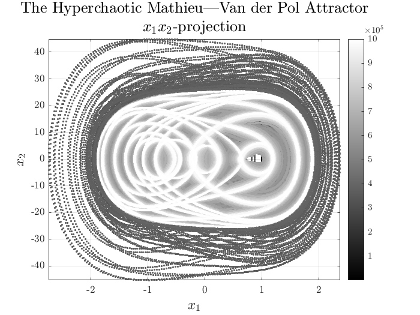

# Dynamics of Hyperchaotic Attractors

The repository will feature a gallery of high-dimensional hyperchaotic attractors  plotted by me in MATLAB based on [General Algorithm of The Explicit Runge—Kutta Method](https://github.com/whydenyscry/General-algorithm-of-the-explicit-Runge-Kutta-method).

The plots are also available on Pinterest and Behance:

## Relevant Repositories:
- [Dynamics of Chaotic 3D Attractors: Part 1](https://github.com/whydenyscry/Dynamics-of-Chaotic-Attractors-Part-1)
- [Dynamics of Chaotic 3D Attractors: Part 2](https://github.com/whydenyscry/Dynamics-of-Chaotic-Attractors-Part-2)

## The Hyperchaotic Mobayen—Mostafaee Attractor
**Reference:**\
[Mobayen, S., Mostafaee, J., Alattas, K. A., Ke, M., Hsueh, Y., & Zhilenkov, A. (2024). A new hyperchaotic system: circuit realization, nonlinear analysis and synchronization control. Physica Scripta, 99(10), 105204.](https://doi.org/10.1088/1402-4896/ad71fc)

$$
\begin{cases}
\dfrac{\mathrm{d}x_1}{\mathrm{d}t} = \alpha_1 x_6, \\
\dfrac{\mathrm{d}x_2}{\mathrm{d}t} = -\alpha_2 x_4 - x_1 x_3, \\
\dfrac{\mathrm{d}x_3}{\mathrm{d}t} = -\alpha_3 x_3 + x_1 x_2, \\
\dfrac{\mathrm{d}x_4}{\mathrm{d}t} = \alpha_4 x_5, \\
\dfrac{\mathrm{d}x_5}{\mathrm{d}t} = \alpha_5 x_2 - x_7, \\
\dfrac{\mathrm{d}x_6}{\mathrm{d}t} = -\alpha_6 x_1 - x_5, \\
\dfrac{\mathrm{d}x_7}{\mathrm{d}t} = -\alpha_7 x_6 - x_1.
\end{cases}
$$

$$
\begin{bmatrix}
\alpha_1 \\ 
\alpha_2 \\ 
\alpha_3 \\ 
\alpha_4 \\ 
\alpha_5 \\ 
\alpha_6 \\ 
\alpha_7
\end{bmatrix}
=
\begin{bmatrix}
90 \\ 
12 \\ 
200 \\ 
6 \\ 
5.17 \\ 
43.2 \\ 
30
\end{bmatrix}.
$$

  

  

## The Hyperchaotic Pang—Liu Attractor
**Reference:**\
[Pang, S., & Liu, Y. (2011). A new hyperchaotic system from the Lü system and its control. Journal of Computational and Applied Mathematics, 235(8), 2775–2789.](https://doi.org/10.1016/j.cam.2010.11.029)

$$ 
\begin{cases}
	\frac{\mathrm{d}x_1}{\mathrm{d}t} = \alpha\left(x_2-x_1\right)	\\
	\frac{\mathrm{d}x_2}{\mathrm{d}t} = -x_1x_3+\varsigma x_2+x_4, \\
	\frac{\mathrm{d}x_3}{\mathrm{d}t} = x_1x_2-\beta x_3, \\
	\frac{\mathrm{d}x_4}{\mathrm{d}t} = -\delta x_1 -\varepsilon x_2,
\end{cases}
$$

$$
\begin{bmatrix}
	\alpha\\
	\beta\\
	\varsigma\\
	\delta\\
	\varepsilon
\end{bmatrix} = \begin{bmatrix}
	36\\
	3\\
	20\\
	2\\
	2
\end{bmatrix}.
$$

  

  

## The Hyperchaotic Rössler Attractor
**Reference:**\
[Rossler, O. E. (1979). An equation for hyperchaos. Physics Letters A, 71(2-3), 155–157.](https://doi.org/10.1016/0375-9601(79)90150-6)

$$ 
\begin{cases}
	\frac{\mathrm{d}x_1}{\mathrm{d}t} =-x_2-x_3	\\
	\frac{\mathrm{d}x_2}{\mathrm{d}t} = x_1+\alpha x_2+x_4, \\
	\frac{\mathrm{d}x_3}{\mathrm{d}t} = \beta+x_1x_3, \\
	\frac{\mathrm{d}x_4}{\mathrm{d}t} = -\varsigma x_3+\delta x_4,
\end{cases}
$$

$$
\begin{bmatrix}
	\alpha\\
	\beta\\
	\varsigma\\
	\delta
\end{bmatrix} = \begin{bmatrix}
	0.25\\
	3\\
	0.5\\
	0.05
\end{bmatrix}.
$$

  

  

## The Hyperchaotic Dadras—Momeni—Qi Attractor
**Reference:**\
[Dadras, S., Momeni, H. R., Qi, G., & Wang, Z. (2011). Four-wing hyperchaotic attractor generated from a new 4D system with one equilibrium and its fractional-order form. Nonlinear Dynamics, 67(2), 1161–1173.](https://doi.org/10.1007/s11071-011-0060-0)

$$ 
\begin{cases}
	\frac{\mathrm{d}x_1}{\mathrm{d}t} = \alpha x_1 -x_2x_3+x_4,	\\
	\frac{\mathrm{d}x_2}{\mathrm{d}t} = x_1x_3 -\beta x_2, \\
	\frac{\mathrm{d}x_3}{\mathrm{d}t} = x_1x_2-\varsigma x_3+x_1x_4, \\
	\frac{\mathrm{d}x_4}{\mathrm{d}t} = -x_2,
\end{cases}
$$

$$
\begin{bmatrix}
	\alpha\\
	\beta\\
	\varsigma
\end{bmatrix} = \begin{bmatrix}
	8\\
	40\\
	14.9
\end{bmatrix}.
$$

  

  

## The Hyperchaotic Mathieu—Van der Pol Attractor
**Reference:**\
[Li, S.-Y., Huang, S.-C., Yang, C.-H., & Ge, Z.-M. (2012). Generating tri-chaos attractors with three positive Lyapunov exponents in new four order system via linear coupling. Nonlinear Dynamics, 69(3), 805–816.](https://doi.org/10.1007/s11071-011-0306-x)

$$ 
\begin{cases}
	\frac{\mathrm{d}x_1}{\mathrm{d}t} = x_2,	\\
	\frac{\mathrm{d}x_2}{\mathrm{d}t} = -\left(\alpha + \beta x_3\right)x_1-\left(\alpha+\beta x_3\right)x_1^3-\varsigma x_2 +\delta x_3, \\
	\frac{\mathrm{d}x_3}{\mathrm{d}t} = x_4, \\
	\frac{\mathrm{d}x_4}{\mathrm{d}t} = -\varepsilon x_3 + \vartheta\left(1-x_3^2\right)x_4+\zeta x_1 ,
\end{cases}
$$

$$
\begin{bmatrix}
	\alpha\\
	\beta\\
	\varsigma\\
	\delta\\
	\varepsilon\\
	\vartheta\\
	\zeta
\end{bmatrix} = \begin{bmatrix}
	91.17\\
	5.023\\
	-0.001\\
	91\\
	87.001\\
	0.018\\
	9.5072
\end{bmatrix}.
$$

  

  

## The Hyperchaotic Li—Sprott—Thio Attractor
**Reference:**\
[Li, C., Sprott, J. C., & Thio, W. (2014). Bistability in a hyperchaotic system with a line equilibrium. Journal of Experimental and Theoretical Physics, 118(3), 494–500.](https://doi.org/10.1134/s1063776114030121)

$$ 
\begin{cases}
	\frac{\mathrm{d}x_1}{\mathrm{d}t} = x_2-x_1x_3-x_2x_3+x_4,	\\
	\frac{\mathrm{d}x_2}{\mathrm{d}t} = \alpha x_1x_3, \\
	\frac{\mathrm{d}x_3}{\mathrm{d}t} = x_2^2-\beta x_3^2, \\
	\frac{\mathrm{d}x_4}{\mathrm{d}t} = -\varsigma x_2,
\end{cases}
$$

$$
\begin{bmatrix}
	\alpha\\
	\beta\\
	\varsigma
\end{bmatrix} = \begin{bmatrix}
	5\\
	0.28\\
	0.05
\end{bmatrix}.
$$

  

  

## The Hyperchaotic Yi—Xiao—Yu Attractor
**Reference:**\
[Yi, L., Xiao, W., Yu, W., & Wang, B. (2018). Dynamical analysis, circuit implementation and deep belief network control of new six-dimensional hyperchaotic system. Journal of Algorithms & Computational Technology, 174830181878864.](https://doi.org/10.1177/1748301818788649)

$$ 
\begin{cases}
	\frac{\mathrm{d}x_1}{\mathrm{d}t} = \alpha (x_2 - x_1) + x_4, \\
	\frac{\mathrm{d}x_2}{\mathrm{d}t} = \varsigma x_1 - x_2 - x_1 x_3 - x_5, \\
	\frac{\mathrm{d}x_3}{\mathrm{d}t} = -\beta x_3 + x_1 x_2, \\
	\frac{\mathrm{d}x_4}{\mathrm{d}t} = \delta x_4 - x_2 x_3, \\
	\frac{\mathrm{d}x_5}{\mathrm{d}t} = \vartheta x_2, \\
	\frac{\mathrm{d}x_6}{\mathrm{d}t} = -\varepsilon x_6 + x_3 x_4,
\end{cases}
$$

$$
\begin{bmatrix}
	\alpha\\
	\beta\\
	\varsigma\\
	\delta\\
	\varepsilon\\
	\vartheta
\end{bmatrix} =
\begin{bmatrix}
	10\\
	\frac{8}{3}\\
	28\\
	-1\\
	10\\
	3
\end{bmatrix}.
$$

  

  

